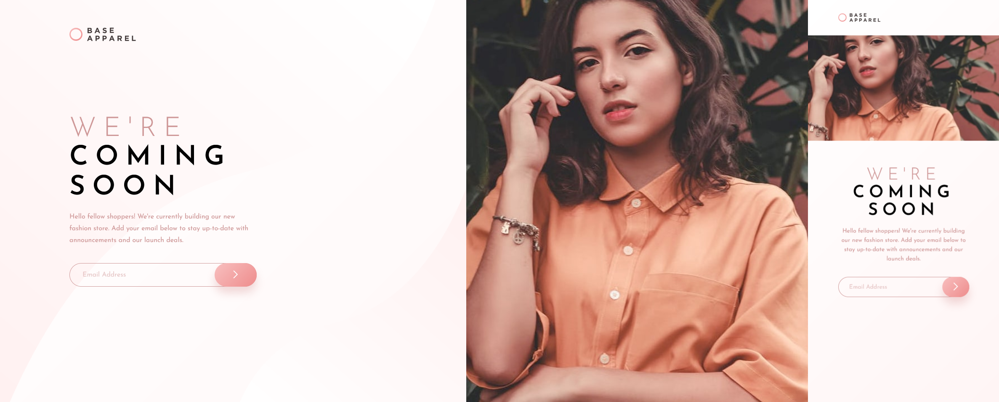

# Frontend Mentor - Base Apparel coming soon page solution

This is a solution to the [Base Apparel coming soon page challenge on Frontend Mentor](https://www.frontendmentor.io/challenges/base-apparel-coming-soon-page-5d46b47f8db8a7063f9331a0). Frontend Mentor challenges help you improve your coding skills by building realistic projects. 

## Table of contents

- [Overview](#overview)
  - [The challenge](#the-challenge)
  - [Screenshot](#screenshot)
  - [Links](#links)
- [My process](#my-process)
  - [Built with](#built-with)
  - [What I learned](#what-i-learned)
  - [Continued development](#continued-development)
- [Author](#author)

## Overview

### The challenge

Users should be able to:

- View the optimal layout for the site depending on their device's screen size
- See hover states for all interactive elements on the page
- Receive an error message when the `form` is submitted if:
  - The `input` field is empty
  - The email address is not formatted correctly

### Screenshot

### Links

- Solution URL: [https://github.com/LuisCBeltran/base-apparel-coming-soon-master](https://github.com/LuisCBeltran/base-apparel-coming-soon-master)
- Live Site URL: [https://luiscbeltran.github.io/base-apparel-coming-soon-master/](https://luiscbeltran.github.io/base-apparel-coming-soon-master/)

## My process

### Built with

- Flexbox
- CSS Grid
- Mobile-first workflow
- JavaScript
- Sass
- Pug

### What I learned

I learned how to validate an email input and modify css properties through JavaScript.

### Continued development

In this project, I feel very confident with my HTLM and CSS skills, but I had a hard time using JavaScript. I have to focus more on the programming language.

## Author

- Website - [Luis C. Beltrán](https://github.com/LuisCBeltran)
- Frontend Mentor - [@LuisCBeltran](https://www.frontendmentor.io/profile/LuisCBeltran)
- Twitter - [@luisc_beltran](https://twitter.com/luisc_beltran)
